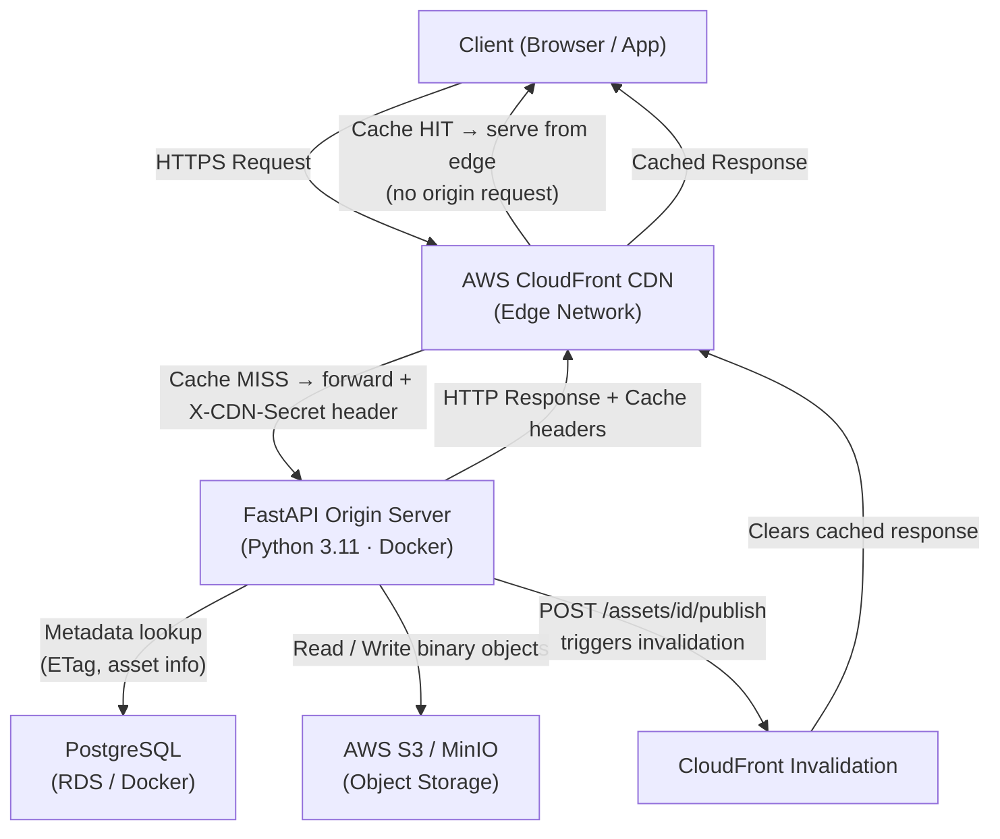

# Architecture — AWS Content Delivery API

## System Overview



---

## Request Flow: Client → CDN → API → Storage

### Flow 1: Public Asset (First Request — Cache MISS)
```
Client
  │  GET /assets/{id}/download
  ▼
CloudFront Edge
  │  Cache MISS — not in CDN cache
  │  Forwards request to origin, adds X-CDN-Secret header
  ▼
FastAPI (Origin Shield validates X-CDN-Secret)
  │  Queries PostgreSQL: SELECT * FROM assets WHERE id = ?
  │  Checks If-None-Match header (ETag comparison)
  │  On cache miss: fetches binary from S3/MinIO
  ▼
S3 / MinIO
  │  Returns binary object bytes
  ▼
FastAPI
  │  Responds: 200 OK
  │  Headers: ETag, Cache-Control: public s-maxage=3600, Last-Modified
  ▼
CloudFront
  │  Caches response at edge (s-maxage = 3600 seconds)
  ▼
Client  ← receives response
```

### Flow 2: Public Asset (Subsequent Requests — Cache HIT)
```
Client
  │  GET /assets/{id}/download
  ▼
CloudFront Edge
  │  Cache HIT — serves from edge cache
  │  No origin request made (0ms server-side latency)
  ▼
Client  ← response from edge (low latency ~5-30ms)
```

### Flow 3: Conditional GET (Browser ETag Revalidation)
```
Client (has ETag from previous response)
  │  GET /assets/{id}/download
  │  If-None-Match: "sha256-hex-stored-etag"
  ▼
FastAPI
  │  DB lookup: SELECT etag FROM assets WHERE id = ?
  │  Compares stored ETag with client ETag
  │  MATCH → 304 Not Modified (no body, no S3 request)
  ▼
Client  ← 304 response (headers only, full bandwidth savings)
```

### Flow 4: Immutable Versioned Asset
```
Client
  │  GET /assets/public/{version_id}
  ▼
CloudFront Edge
  │  Cache HIT after first request (immutable, 1 year TTL)
  │  On cold: forwards to origin
  ▼
FastAPI
  │  DB join: asset_versions ⨝ assets WHERE av.id = ?
  │  Downloads from S3: assets/{id}/versions/{version_id}/file
  │  Responds: 200 OK Cache-Control: public, max-age=31536000, immutable
  ▼
CloudFront → caches for 1 year → Client
```

### Flow 5: Private Asset via Token
```
Client
  │  GET /assets/private/{token}
  ▼
FastAPI (CloudFront configured NOT to cache private/* paths)
  │  DB lookup: SELECT * FROM access_tokens WHERE token = ?
  │  Validates token exists + expires_at > NOW()
  │  DB lookup: SELECT * FROM assets WHERE id = token.asset_id
  │  Downloads from S3
  │  Responds: 200 OK Cache-Control: private, no-store, no-cache
  ▼
Client  ← private content (never cached by CDN or shared caches)
```

### Flow 6: Publish New Version (CDN Invalidation)
```
Client (admin/uploader)
  │  POST /assets/{id}/publish  multipart/form-data file=...
  ▼
FastAPI
  │  Reads new file bytes
  │  Computes new SHA-256 ETag
  │  Uploads to S3: assets/{id}/versions/{new_uuid}/filename
  │  DB transaction:
  │    INSERT INTO asset_versions (id, asset_id, key, etag)
  │    UPDATE assets SET etag=?, current_version_id=? WHERE id=?
  │  Creates CloudFront invalidation: /assets/{id}/download
  ▼
CloudFront
  │  Clears cached /assets/{id}/download from all edge nodes
  ▼
Next client request → Cache MISS → Origin fetches new content
```

---

## Component Responsibilities

### FastAPI App (`app/`)
| Module | Responsibility |
|--------|---------------|
| `main.py` | App factory, middleware registration, lifespan (DB pool) |
| `config.py` | Pydantic-settings — reads env vars |
| `database.py` | asyncpg connection pool + migration runner |
| `storage.py` | S3/MinIO boto3 operations (upload, download, stream) |
| `cdn.py` | CloudFront invalidation (no-op when CDN_ENABLED=false) |
| `routes/upload.py` | `POST /assets/upload` |
| `routes/download.py` | `GET\|HEAD /assets/{id}/download` |
| `routes/publish.py` | `POST /assets/{id}/publish` |
| `routes/public.py` | `GET /assets/public/{version_id}` |
| `routes/private.py` | `GET /assets/private/{token}` |
| `routes/token.py` | `POST /assets/{id}/token` |
| `utils/etag.py` | SHA-256 ETag generation and parsing |
| `utils/token.py` | Secure token generation, expiry validation |
| `middleware/origin_shield.py` | Blocks non-CDN traffic when enabled |

### PostgreSQL (Metadata Store)
```sql
assets           -- Core record: etag, mime_type, size, current_version pointer
asset_versions   -- Immutable snapshots with own S3 keys and ETags
access_tokens    -- Short-lived tokens (token, asset_id, expires_at)
```
- ETag is computed once on upload/publish — **never recalculated on GET**
- DB stores only metadata; binary content lives entirely in S3

### AWS S3 / MinIO (Object Storage)
- `assets/{asset_id}/{filename}` — original upload
- `assets/{asset_id}/versions/{version_id}/{filename}` — versioned snapshot
- S3 bucket is **not publicly accessible**; API proxies all content
- In production: real AWS S3 with IAM role; in dev: MinIO via Docker

### AWS CloudFront (CDN)
- Deployed in front of the FastAPI origin
- **Cache behavior**: forwards and honors `Cache-Control` from origin
- **Custom origin header**: `X-CDN-Secret` injected on all origin requests
- **Cache invalidation**: programmatically triggered by `POST /assets/{id}/publish`

---

## HTTP Caching Strategy

| Endpoint | Cache-Control | ETag | CDN Invalidation |
|---|---|---|---|
| `GET /assets/{id}/download` (public) | `public, s-maxage=3600, max-age=60` | Yes → 304 | On publish |
| `GET /assets/{id}/download` (private) | `private, no-store, no-cache, must-revalidate` | (no 304) | N/A |
| `GET /assets/public/{version_id}` | `public, max-age=31536000, immutable` | Yes | Never needed — new version = new URL |
| `GET /assets/private/{token}` | `private, no-store, no-cache, must-revalidate` | (no 304) | Token TTL handles access revocation |

---

## Security Design

| Control | Implementation |
|---|---|
| **Origin shielding** | `X-CDN-Secret` header validated by middleware; returns 403 for direct access |
| **Private tokens** | `secrets.token_hex(32)` — 256 bits of cryptographic entropy |
| **Token expiry** | DB `expires_at` checked on every request (not cached) |
| **Token in URL** | Tokens in URL path (not query params) — cleaner log scrubbing |
| **S3 private** | Bucket not public; all content served through authenticated API proxy |
| **No wildcard S3** | Each asset has a unique key — no namespace collision possible |
